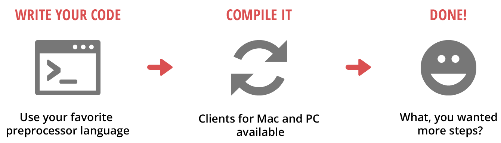
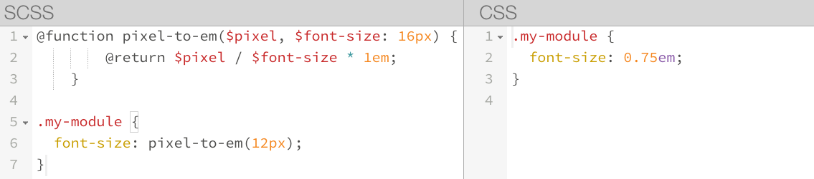
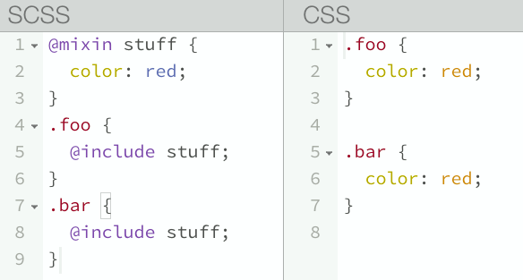

# Intro to the Magic and Power of Sass + Compass

http://nickgrace.github.io/intro-to-sass

--

## Hi! I'm...

* Nick Grace, front end development manager at [JBS International, Inc.](http://www.jbsinternational.com) and front-end development instructor with [General Assembly](http://www.ga.co). I'm [@nickgrace](https://twitter.com/nickgrace) just about everywhere.

--

## JBS International, Inc.


http://www.jbsinternational.com

--

## Agenda

* CSS is Messy
* CSS Preprocessors
* What is Sass
* Primary Features of Sass
* Compass
* Basic Setup and Workflow
* Bundler
* Resources

---

# CSS is Messy

--

## CSS is Messy

> CSS stops short of even more powerful features... That is because these things give power-users a lot of rope, but less experienced users will unwittingly hang thenselves; or, more likely, be so scared that they won't even touch CSS.

Bert Bos, CSS co-inventor

--

## CSS is Messy

CSS has not aged well.

* Vendor-specific prefixes in CSS3
* Not scalable
* Bloat
* Selector inheritance is hard!

---

# CSS Preprocessors

--

## CSS Preprocessors

Preprocessors allows:

* Reduced repetition
* Cleaner modularity
* Maintainability
* Programming

--

## CSS Preprocessors



[Using A CSS Preprocessor - Pros And Cons From The Front Line](http://www.nosleepforsheep.com/development/using-a-css-preprocessor/)

--

## CSS Preprocessors


---

# What is Sass?


--

## What is Sass?

* Sass is a language construct to create CSS.
* Sass is written in Ruby, and distributed via the Ruby package manager, RubyGems.
* It makes writing awesome CSS much easier.
* Extends CSS syntax by adding variables, nesting, mixins, partials, and selector inheritance.

--

## What is Sass?

Invented by Hampton Catlin in 2007 and developed by Natalie Weizenbaum and (later) Chris Eppstein.

It makes increasingly complex CSS easier to write and manage.

--

## What is Sass?

* Sasscript
* Sass CSS Preprocessor

--

## What is Sass?

Sass compiles in CSS files.


--

## Syntax

Sass has TWO syntaxes:

* .sass (SassyCSS)
* .scss (the indented syntax)

--

## .sass - whitespace sensitive

```
// .sass
	.my-selector
		font-size: 2em
		background: #333
		font-family: $monospace
```

* Uses indentation to specify blocks of code.
* SassScript stylesheets use ```*.sass``` extension.
* Older syntax.

--

## .scss - superset of CSS

```
// .scss
	.my-selector {
		font-size: 2em;
		background: #333;
		font-family: $monospace;
	}
```

* Superset of CSS syntax and uses brackets and semicolons.
* SCSS stylesheets use ```*.scss``` extension.
* Most commonly used.

---

# Primary Features

* Partials
* Nesting
* Variables
* Mixins
* Functions
* Extendables & Selector Inheritance

--

# Partials

--

## Partials

Break up large style sheets using partials. Helps you organize your CSS.

--

## Partials


--

## Partials


--

## Partials


--

# Nesting

--

## Nesting

* Lets our code be DRY.
* Lets our styles be less redundant and easier to follow.
* Lets us organize our code into blocks.

--

## Nesting


--

## Nesting: The Parent Selector


--

## Nesting: The Parent Selector

You can also append a suffix to the ampersand.


--

## Nesting: Media Queries!


--

# Variables

--

## Variables

* Variables allow you to assign a value to a placeholder name.
* Works with numbers, strings, colors, and booleans.

--

## Variables

```$width: 1em;```

```
.content-block {
	width: $width;
}
```

--

## Variables


--

## Variables

* Colors
* Font sizes
* Font families
* Font paths
* border-radius
* Pseudo content
* Shadows
* Gradients
* Padding
* Margins
* Breakpoints
* More

--

## Variables

```
// Numbers
$base-padding: 20px;
$line-height: 2em;

// Strings
$base-font: Arial;
$content: "Loading";

// Colors
$feature-color: green;
$header-background: rgba(0, 255, 0, 0.5)

// Lists
$base-margin: 20px 0 30px 10px;
$base-font: "Trebuchet MS", "Verdana", san-serif;

// Booleans
$bordered: true;
$shadowed: false;
```

--

# Mixins

--

## Mixins

* Mixins are reusable sets of properties or rules that you include, or "mix," into other rules.

* Mixins are similar to functions, except they return blocks of CSS.

--

## Mixins


--

## Mixins


--

## Mixins & Arguments


--

## Mixins & Colors


--

## Mixins & Colors


--

# Functions

--

## Functions

A function is similar to a mixin, however, the output is a single value.

--

## Functions



--

## Functions


--

# Extendables/Selector Inheritance

--

## Extendables/Selector Inheritance

Extendables allow you to build upon a common style.

--

## Extendables/Selector Inheritance


--

## Extendables/Selector Inheritance



---

# Compass


--

## Compass

* Compass is a meta-framework for Sass.
* Provides useful mixins and functions.
* Includes plugin framework to allow for community written extensions.

[compass-style.org](http://www.compass-style.org)

--

## Compass Features

* Vendor prefixing
* Sprite generation
* CSS3 Animations
* Typography and styling patterns
* Breakpoints and Grids
* More

--

## Compass extensions

These are Ruby gems, just like Sass and Compass.

* [CSS3 Animations](http://rubygems.org/gems/animation)
* [Sassy text-shadow](https://rubygems.org/gems/sassy-text-shadow)
* [Sassy Buttons](http://rubygems.org/gems/sassy-buttons), Sassy CSS3 buttons
* [Breakpoint](https://rubygems.org/gems/breakpoint), simple MQs with Sass
* [Singularity](https://rubygems.org/gems/singularitygs), Grids without Limits

--

## Compass: Vendor Prefixing


--

## Compass: Sprite Generation


--

## Compass: Sprite Generation

```
@import "compass/utilities/sprites";
@import "my-icons/*.png";
@include all-my-icons-sprites;

.my-icons-sprite,
.my-icons-delete,
.my-icons-edit,
.my-icons-new,
.my-icons-save  {background:url('/images/my-icons-s3e064ab.png') no-repeat; }

.my-icons-delete { background-position: 0 0; }
.my-icons-edit   { background-position: 0 -32px; }
.my-icons-new    { background-position: 0 -64px; }
.my-icons-save   { background-position: 0 -96px; }
```

[Spriting with Compass](http://compass-style.org/help/tutorials/spriting/)

--

## Compass: CSS3 Animations

[Example](http://sassmeister.com/gist/7513b5d11239cfb744cb)

--

## Compass: Typography and styling patterns

[Example](http://sassmeister.com/gist/f93bb4d2d5e82d6b33f6)

--

## Compass: Breakpoint

$nav-lg: 680px;

```
// Sass
.main-nav {
	width: 100%;

	@include breakpoint($nav-lg) {
		width: 60%;
		margin: 0 auto;
	}
}
```

```
/* CSS */

.main-nav {
	width: 100%;
}
@media (min-width: 680px) {
	.main-nav {
		width: 60%;
		margin: 0 auto;
	}
}
```

--

## Compass: Breakpoint

[Breakpoint Example](http://sassmeister.com/gist/73a53395a4df14a38aab)

--

## Compass: Grids


--

## Compass: Grids


--

## Compass: Grids

[Singularitygs 960 Example](http://sassmeister.com/gist/c0f9776f4a0e3fcc9fc8)

---

# Basic Setup and Workflow

--

## Sass Installation: Ruby

OS X: Ruby comes preinstalled!

--

## Sass Installation: Rubyinstaller for Windows


http://rubyinstaller.org

--

## Sass Installation: Sass

```gem install sass```

--

## Running Sass

Navigate to your project folder, then:

```sass source.sass output.css```

or


```sass source_dir output_dir```

--

## Sass Watch

```sass watch source.sass:output.css```

--

## GUI Approach: Codekit


https://incident57.com/codekit/

--

## GUI Approach: Scout


http://mhs.github.io/scout-app/

--

## GUI Approach: Koala


http://koala-app.com/

--

## Other Sass Setups

* [Scssphp](https://github.com/leafo/scssphp)
* [sass-java](https://github.com/darrinholst/sass-java)
* [node-sass](https://npmjs.org/package/node-sass)
* [libsass](https://github.com/hcatlin/libsass)

--

## Compass Setup

Use ```@import "compass"``` in your Sass file.

---

# Bundler


--

## Bundler: Unifying Gem Versions

When working on different computers, developers, or even projects, there will always be an issue with ruby gems changing between different versions.

We want to make sure that we know which versions of each gem we are using to prevent compiling differences and errors. Bundler allows us to do just that. But first, we need to make sure we have Bundler installed:

```gem install bundler```

--

## Bundler: Unifying Gem Versions

The Gemfile that comes with the project will tell Bundler exactly what versions of what gems to use. Use the following command to create a Gemfile.lock file within your project or theme to install gem dependencies you may not already have and to lock each gem version.

```bundle install```

--

## Bundler: Unifying Gem Versions

From now on, instead of running "compass watch" or "compass compile", you can use:

```bundle exec compass watch```

And bundler will only use the gem versions selected within the .lock file.

---

# Resources

* [Sass](http://sass-lang.com)
* [Compass](http://compass-style.org)
* [LevelUpTuts (Free Tutorials)](http://leveluptuts.com/tutorials/sass-tutorials)
* [Treehouse (Sass Basics)](http://teamtreehouse.com/library/sass-basics)
* [The Sass Way](http://thesassway.com)
* [Sass Bites](https://www.youtube.com/user/sassbites)
* [Sass News](https://twitter.com/SassNews)
* Meetups: [Austin](https://twitter.com/ATXSass), [Baltimore](https://twitter.com/BmoreSass), [DC](http://sassydc.github.io/), [Denver](http://www.meetup.com/Sass-Hack-Denver/), [NYC](http://www.meetup.com/gothamsass/), [Philly](http://www.meetup.com/Philadelphia-SASS-Meetup-Group/), [Portland](https://twitter.com/PDXSass), [Seattle](http://www.meetup.com/SeattleFrontEnd/)
* [SassConf](http://sassconf.com/) Oct 2-4, 2014, NYC
